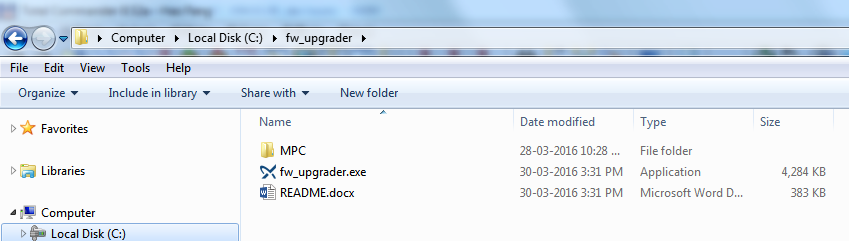

fw_upgrader is a tool which used to download firmware into Cu3x2 products.

[Online document](http://fw-upgrader.readthedocs.org/)

## FEATURES
- Auto download process based on web interface provided by Cu3x2.
- Internal TFTP server.

## DESCRIPTION

Normally, if you want to download firmware into Cu3x2 products, you need to:

1. Run a 3rd party tftp tool such as **TFTP64.exe**.
2. Specify the MPC folder.
2. Open webpage, launch java applet and wait a minute to see the home page.
3. Go to download page, change the server address, and then click start button.
4. When downloading finished, you also need to click reboot button and wait a minute to refresh this page.
5. Verify the firmware version.

Use this tool, just one command:
```bash
fw_upgrader -c 10.208.32.125
```

It will then automatically run a tftp server inside and then simulate above steps in webpage, if everything is OK, a progress bar will show. When finished, it will auto reboot and show the new firmware version.

## INSTALLATION

- Download fw_upgrader into any folder in your PC. (For example, c:\\fw_upgrader)

- Create a new folder **MPC** inside and copy cu362_firmware.bin into MPC folder.
    


## PREREQUISITES

There are some settings needed before start to use fw_upgrader. Please read [setting](setting.md).

## USAGE

Resume that Cu3x2 product on your hand is using DHCP to get IP address and IP is "10.208.32.125".

- Open cmd window and change directory to this folder(c:\\fw_upgrader).

- Run this command: `fw_upgrader.exe -c 10.208.32.125`. First time to run this command, **Windows Security Alert** pops up, please mark all checkbox and click "Allow access".


- fw_upgrader start to download firmware automatically, eventually you can get result as below screenshot.


## ARGUMENTS

Optional arguments:

| argument                     | description                                                                  |
|------------------------------|------------------------------------------------------------------------------|
| -h, \-\-help                 | show this help message and exit                                              |
| -p, \-\-path                 | path to the directory which contains MPC folder and firmware bin file inside |
| -s, \-\-server               | server IP                                                                    |
| -c, \-\-controller           | controller IP                                                                |
| -r, \-\-route_ip             | route IP, same as server IP if not set                                       |
| -l, \-\-loglevel             | log level, 0=no log, 1=info, 2=debug                                         |
| -t, \-\-timeout              | timeout for tftp server, default=20s                                         |
| -w, \-\-web_response_timeout | timeout for web response, default=20s                                        |
| -n, \-\-noreboot             | enable this to skip reboot                                                   |

**Note:**

- Only *-c/--controller* is force required.
- If you don't set server IP, fw_upgrader will auto get IP for you, but if you have more than 2 IP(for example, an additional USB Ethernet card is installed), please add *-s/--server* argument to specify which IP you want to use.
