## Firewall settings

1. Open up, Start -> Control panel -> Windows firewall, and choose "Allow a program or feature…"
 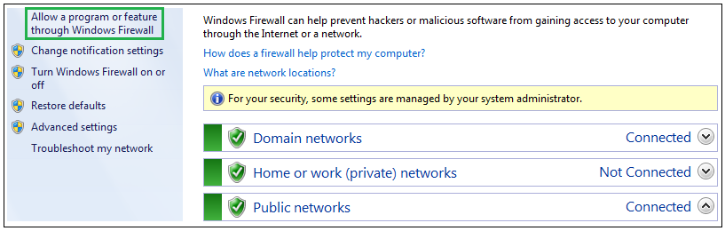
1. Mark **all 3 checkbox** under fw_upgrader and press "OK" (Login may be required under "Change settings")
 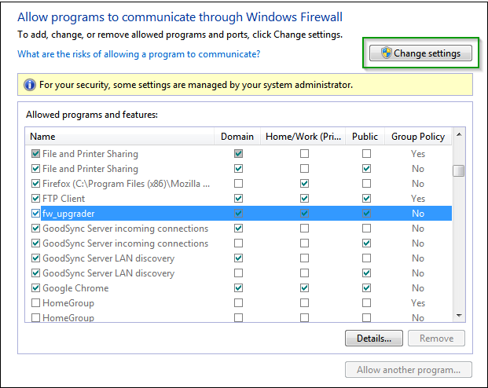

## Protocol settings
1. Open up, Start -> Control panel -> Administrative Tools -> Windows firewall with Advanced Security
1. Click -> Inbound Rules -> New Rule
 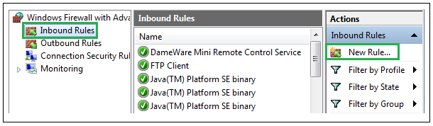
1. Choose custom and click next
 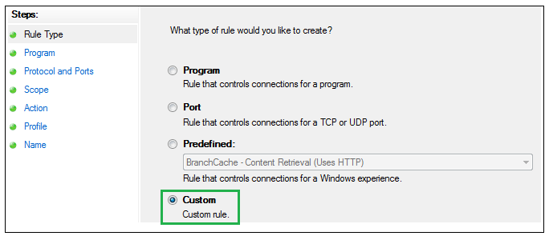
1. Enter "Protocol and Ports" and set the Protocol type to ICMPv4 and click customize
 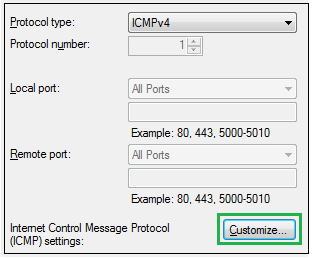
1. Choose Specific ICMP types, check mark Echo Request, click OK and click nex
 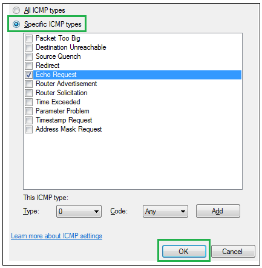
1. Choose Any IP address in both and click next
 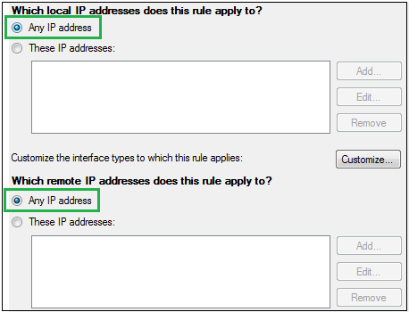
1. Choose Allow the connection and click next
 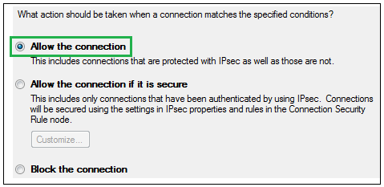
1. Check mark all three and click next
 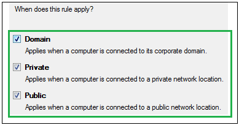
1. Type in a name e.g. "Echo Request" and click finish

## Port settings

Now the first rule is ready and the second rule can be configured

1. Open up, Start -> Control panel -> Administrative Tools -> Windows firewall with Advanced Security
1. Click -> Inbound Rules -> New Rule
 
1. Choose port and click next
 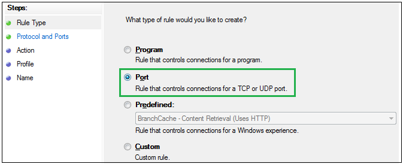
1. Choose UDP and Specific local ports. Set it to 69 and click next
 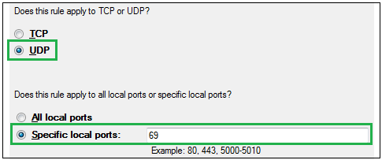
1. Choose allow the connection and click next
 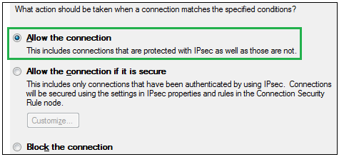
1. Check mark all three and click next
 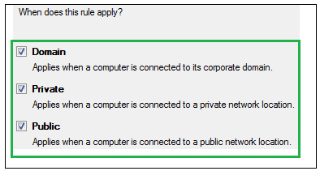
1. Type in a name e.g. "TFTP UDP 69" and click finish
